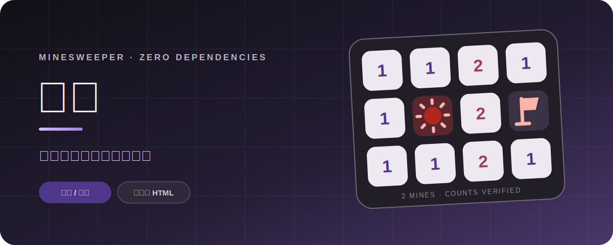

<div align="center">

### 不靠运气，也能走到最后。

一个装进单个 HTML 文件里的现代扫雷。保留经典规则，也提供可推理完成的无猜棋盘。

[**开始一局 →**](https://cizuwuxin.github.io/minesweeper/)　　[阅读源码](./index.html)

</div>

---

<table>
<tr>
<td width="33%" valign="top">

### 01 · 两种解法

想要原汁原味，就选经典模式；想让每一步都有依据，就进入无猜模式。

</td>
<td width="33%" valign="top">

### 02 · 一份文件

界面、规则、求解与数据存储都位于 `index.html`，下载后无需安装即可运行。

</td>
<td width="33%" valign="top">

### 03 · 多种输入

鼠标、键盘与触控均可完整操作；棋盘支持缩放、拖动及长按标记。

</td>
</tr>
</table>

## 棋盘里有什么

| 能力 | 说明 |
| :-- | :-- |
| **五种棋盘入口** | 简单、中等、困难、自定义、随机 |
| **无猜生成** | 生成可通过逻辑继续推进的局面，超时后自动回退并明确提示 |
| **辅助工具** | 提示、撤销、问号标记、进度条、键盘焦点 |
| **个性设置** | 深色主题、声音反馈、左右键互换、长按延迟 |
| **本地记忆** | 偏好保存在浏览器中，不上传游戏数据 |

## 一眼看懂操作

```text
打开格子       左键 / 点击 / Enter / Space
标记格子       右键 / 长按 / F
移动焦点       方向键
获得提示       H
撤销一步       Ctrl + Z
重新开局       R
```

<details>
<summary><strong>在本地运行</strong></summary>

<br>

直接下载并打开 `index.html` 即可。若浏览器限制本地 Worker，可启动一个静态服务器：

```bash
git clone https://github.com/cizuwuxin/minesweeper.git
cd minesweeper
python3 -m http.server 8000
```

访问 `http://localhost:8000`。

</details>

<details>
<summary><strong>技术说明</strong></summary>

<br>

- 原生 HTML / CSS / JavaScript，无框架和运行时依赖
- Web Worker 执行无猜棋盘求解，避免阻塞主界面
- `localStorage` 保存设置
- GitHub Pages 提供静态部署

</details>

---

<div align="center">

**打开棋盘。读懂数字。做出确定的一步。**

[在线游玩](https://cizuwuxin.github.io/minesweeper/) · [提交反馈](https://github.com/cizuwuxin/minesweeper/issues)

</div>
